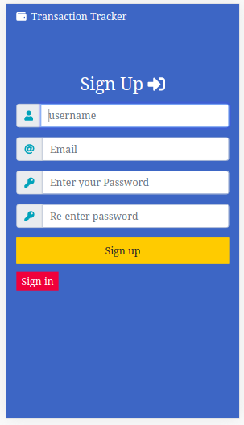
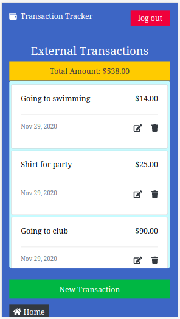

# Transaction Tracker (Ror Capstone)

> This is a Microverse Ruby on rails capstone project that allows users to track their regular day to day transactions. A user can create an account and then can use this app immediately. this app allows user to create different transactions, create groups. An user can put his transactions into several groups of his choice. User can see all the transactions that belongs to a group and those without groups separately. User can also track all the transactions that he or she put on specific groups.  
restricted from using the app until they sign up and log in.








## Live Demo

[Transaction tracker](https://quiet-cove-21395.herokuapp.com/users/sign_in)


## Presentation

[Loom Presentation](https://www.loom.com/share/d3f152edb82747d6829b2ac5241cc33f)

## Features
In this project I developed a simple event app with authentication:

- The form uses Bootstrap library for css combined with embedded ruby code
- The back end is set up with User,Transaction and Group models that validates presence of username,password,transaction title,transaction amount. These models also contains different associations between each other.
- I incorporated devise gem for user's authentication and corresponding actions such as Log in, Log out,Sign up.
- If user check the page without being authenticated, he/she will not be able to see any functionalities. Once user do the login then he/she can use all the functionalities of the app.
- Any user who signed up and logged in can create their own transactions and groups.
- Any user who signed up and logged in can track their grouped and non grouped transactions.
- Transactions view pages displays transaction it's title, date and amount.
- Both group and non group transaction view page display the total amount of transaction.
- group show page displays all the associated transactions with the name of transaction author.

## Built With

- Ruby on Rails
- Ruby
- Rubocop
- Atom text editor
- fontawesome
- Bootstrap
- Rspec gem
- Capybara gem
- simple_form gem
- devise gem
# Getting Started

To get a local copy of the repository please run the following commands on your terminal:

```
$ cd <folder>
```

```bash
$ git clone `https://github.com/ajkacca457/Ror_capstone_transactiontracker.git`
$ cd Ror_capstone_transactiontracker
$ bundle install
$ If styling doest work then run "Yarn add bootstrap jquery popper.js"
$ yarn install --check-files if yarn is not updated
$ Run `rails db:create` to create necessary tables in database
$ Run `rails db:migrate` to create necessary tables in database
$ Run `rails server` to see the user interface.
$ Open your browser and go to http://localhost:3000/
```

### Run tests

```
    rpsec --format documentation
```

# Authors

👤 **Avijit Karmaker**

- Github: [@Avijit](https://github.com/ajkacca457)
- Linkedin:[@Avijit](https://www.linkedin.com/in/avijit-karmaker-8738a54)

## 🤝 Contributing

Contributions, issues and feature requests are welcome!

## Show your support

Give a ⭐️ if you like this project!

## Copyright
This is a project developed by Microverse Student as the part of skill curriculum.
